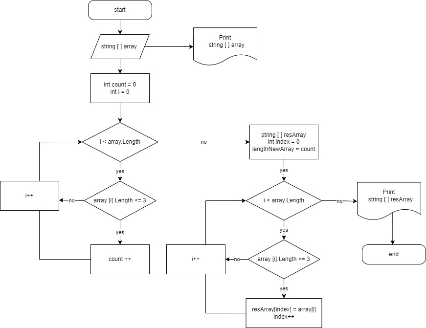

# Итоговая проверочная работа

## Задача

Hаписать программу, которая из имеющегося массива строк формирует массив из строк, длина которых меньше либо равна 3 символа. Первоначальный массив можно ввести с клавиатуры, либо задать на старте выполнения алгоритма. При решении не рекомендуется пользоваться коллекциями, лучше обойтись исключительно массивами.

## Примеры

* ["hello", "2", "world", ":-)"] -> ["2", ":-")]

* ["1234", "1567", "-2", "computer science"] -> ["-2"]

* ["Russia", "Denmark", "Kazan"] -> [ ]

___

## Решение

1. Массив string[ ] array задается на старте выполнения алгоритма.

1. Метод PrintArray выводит на экран заданный массив.

1. С помощью метода ArrLength определяется размер нового массива (запускается цикл,
   который перебирает все элементы заданного массива string[ ] array и с помощью
   счетчика count подсчитывает количество элементов, длинна которых меньше либо равна 3 символам).

1. Метод NewArray создает новый массив, с определенным выше размером. Метод на вход принимает заданный в начале алгоритма массив string[ ] array, проходится циклом по этому массиву и элементами с длинной меньше либо равной 3 символам заполняет новый массив string[ ] resArray.

1. С помощью повторного обращения к методу PrintArray новый массив string[ ] resArray выводится на экран.

___

## Блок-схема алгоритма

